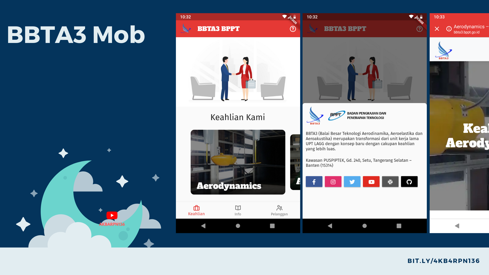

# BBTA3 Mob

> Repository pengembangan aplikasi bbta3 mob
>

Sebelum pengembangan dimulai ada hal-hal yang perlu dilakukan, yaitu:

- Membuat keystore sesuai dengan cara yang ditunjukkan di tautan [DISINI](https://flutter.dev/docs/deployment/android#create-a-keystore).
- Simpan keystore dalam direktori `[APP_DIR]/android/app`.
- Setelah keystore dibuat, buat `key.properties` sesuai tautan [DISINI](https://flutter.dev/docs/deployment/android#reference-the-keystore-from-the-app).

